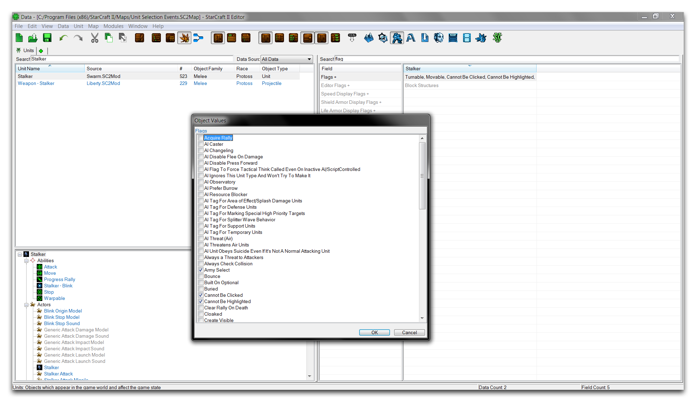
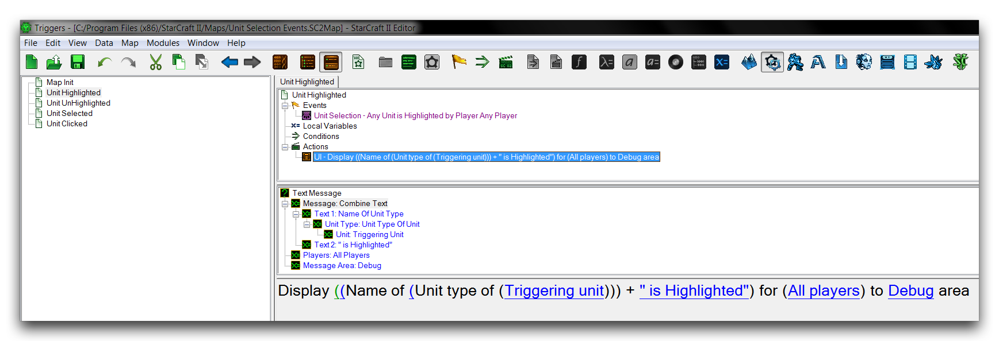
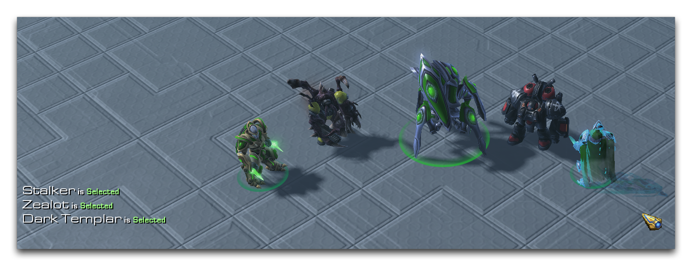

UNIT SELECTION EVENTS
=====================

The ‘Unit Selection’ category of events can be very useful when it comes
to adding ways to interact with units. These events are triggered by
changes in the state of a Unit that occur in response to the mouse
actions of a Player. There are three types of change, which are broken
down in the table below.

  -----------------------------------------------------------------------------------------------------------------------------------------------------------------------------------------------------------------------------------------------------------------------------------------------------------------------------------------------------------------------------------------------------------------------------------------------------------------------------------------------------------------
  Event               Details
  ------------------- ---------------------------------------------------------------------------------------------------------------------------------------------------------------------------------------------------------------------------------------------------------------------------------------------------------------------------------------------------------------------------------------------------------------------------------------------------------------------------------------------
  Unit Selected       Triggers the first time a Player clicks on the Unit, this selects the Unit. The Unit now enters its Selected state. Once the Unit is in this state, it cannot be selected again until it is deselected by the Player and returns to its Basic State. A unit may also be deselected when the Player selects any other game entity. A Player may select many units with a single action either by using a box select with the mouse or holding the CTRL key while clicking a unit.

  Unit Clicked        Triggers every time the Unit is clicked with the mouse by a Player. Can occur indefinitely. The first click on a deselected Unit meets the criteria for both a Unit Clicked event and a Unit Selected event. A Player may only click on a single unit at a time.

  Unit Highlighted/   The highlighted and unhighlighted events trigger is based on the mouse position of the Player as it enters or leaves the area of the Unit respectively. When the mouse pointer first crosses the area of the Unit, the unit triggers its Unit Highlighted event and becomes Highlighted. When the mouse pointer leaves the area of the Highlighted unit, the unit triggers its Unit UnHighlighted event, returning to its Basic state. A Player can only highlight a single unit at a time.
                      
  UnHighlighted       
  -----------------------------------------------------------------------------------------------------------------------------------------------------------------------------------------------------------------------------------------------------------------------------------------------------------------------------------------------------------------------------------------------------------------------------------------------------------------------------------------------------------------

SELECTION STATES
----------------

StarCraft’s UI offers some help with identifying selection states, as
shown in the image below. The caption following the image explains each
state.

{width="6.5in" height="1.8in"}

Unit Basic State – Unit Highlighted – Unit Selected & Highlighted – Unit
Selected

The leftmost picture here shows the unit in its Basic state, it is
neither Selected nor Highlighted and there are no special alterations to
its model as a result. In the second picture from the left, the mouse
has entered that unit’s area, making the unit Highlighted. At this
point, a Unit Highlighted event would trigger. Holding the cursor over a
unit in the Highlighted state causes a pair of illustrative UI changes;
the mouse pointer is altered to a targeting reticle and the unit is
marked with a dashed circle. The color of the circle depends on the
unit’s owner, for a unit belonging to the player it is green, for an
allied or neutral unit it is yellow, and for an enemy unit it is red.

In the third picture from the left, the unit has been clicked for the
first time, the unit is now Selected. This change results in the both
the Unit Selected and Unit Clicked events triggering. A Selected unit’s
model is marked in the UI with an unbroken circle. This circle has the
same alliance-based coloring as the Highlighted cursor. In this case,
the cursor remains on top of the unit, making the unit both Highlighted
and Selected. As a result, both sets of UI features are superimposed.
The unit has both the selection circle and the highlighted circle, and
the cursor remains the highlighting reticle.

In the rightmost picture the mouse has been moved from the area of the
unit, resulting in the Unit Unhighlighted event. The unit is still
selected and still marked with the unbroken selection circle. The cursor
has returned to its basic pointer as the unit is no longer being
highlighted.

SELECTION FLAGS
---------------

Although each unit in the StarCraft engine can be clicked and
highlighted, the data messages that trigger the events are not enabled
by default. You’ll have to edit some game data to enable these
behaviors. Navigate to the Data Editor then to + -&gt; Edit Game Data
-&gt; Units. Find the Unit type that is going to be monitored for
selection events. In this Unit, navigate to the ‘Unit: Flags’ field and
double click to launch an ‘Object Values’ window. For an example, see
the changes made to a stalker in the image below.

{width="5.25in" height="3.03125in"}

Altering a Stalker’s Unit: Flags Field

Scroll down through the unit flags until you reach ‘Cannot Be Clicked’
and ‘Cannot Be Highlighted.’ These flags control the sending of the Unit
Clicked and Unit Highlighted/UnHighlighted events respectively. Once
these flags have been unchecked, the unit type will propagate any events
of their respective type to the Trigger Editor, and should look as they
do in the image below.

{width="2.7604166666666665in" height="2.2291666666666665in"}

Enabling Unit Clicked and Highlighted/UnHighlighted Events for a Unit

EXAMINING UNIT SELECTION EVENTS
-------------------------------

Open the demo map provided with this article, which provides a course
where you can tinker with selection events. This will help to build an
intuitive feel for how selection events arise from a player’s actions.
The course should appear as follows.

{width="5.25in" height="3.03125in"}

Demo Map Course

You’ll see that the map contains several unit types that have been
configured to accept both Unit Clicked and Unit
Highlighted/UnHighlighted events via the Data Editor. Note that these
units are also divided between the player, an allied player, an enemy
player, and neutral. Move to the Trigger Editor to see how unit
selection events will be used in this example.

{width="6.5in" height="2.222916666666667in"}

Output in Response to a Unit Selection Event

The map has been set with some utility revealers, alliance controls, and
invulnerability triggers within the ‘Map Init’ trigger. Beyond that,
there is a trigger for each major unit selection event: Highlighted,
UnHighlighted, Selected, and Clicked. Like the ‘Unit Highlighted’
example trigger shown above, these triggers respond to their events with
a debug message sent to screen space. Using this setup, the map can give
direct feedback for every possible selection action a player can make.
You can explore it by hitting the ‘Test Document’ button in the Editor.

Some illustrative examples of unit selection events are shown below.

{width="5.90625in" height="2.2708333333333335in"}

Marauder is Highlighted, then Clicked and Selected

Here the enemy marauder has been moused over and then clicked. Doing so
has produced a Unit Highlighted, Unit Clicked, and Unit Selected event
in sequence. Note that the last two events happen at the same time in
the Editor, but the clicked event will always occur first in any list.
You can also see that the Marauder’s UI alterations each display a red
coloring, indicating its status as an enemy.

{width="5.90625in" height="2.2708333333333335in"}

Box Selecting all Controlled Units

In this next case, a box selection has been made around the units.
Despite the units being covered by the box overlay, this alone does not
trigger any events.

{width="5.90625in" height="2.2708333333333335in"}

Stalker, Zealot, and Dark Templar Being Simultaneously Selected

Releasing the box selection results in all units belonging to the player
being selected at once. Each unit individually triggers a Unit Selected
event, then proceeds to a Selected state.

{width="6.072916666666667in" height="1.5833333333333333in"}

Repeated Clicking of the Lyote

In this example, a neutral Lyote critter has been repeatedly clicked.
This demonstrates that a Unit can accept an unlimited number of player
clicks, with each triggering a Unit Clicked event.
